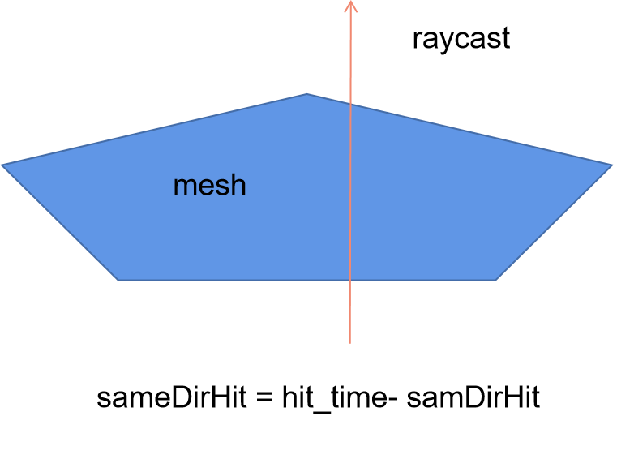
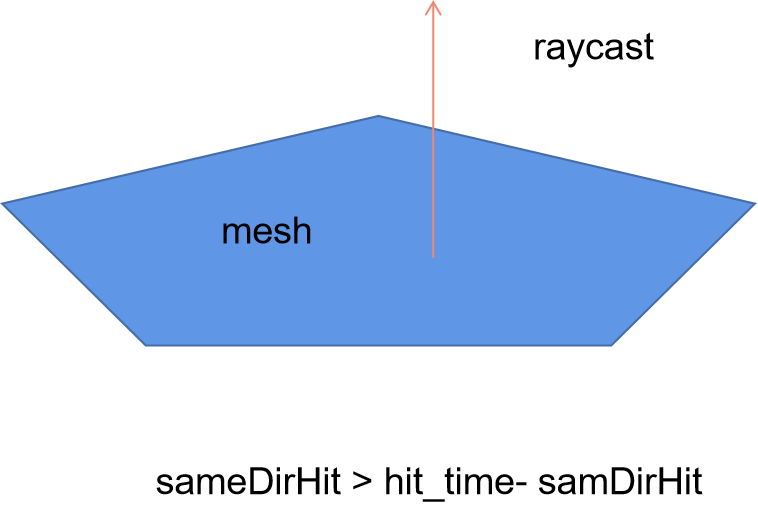
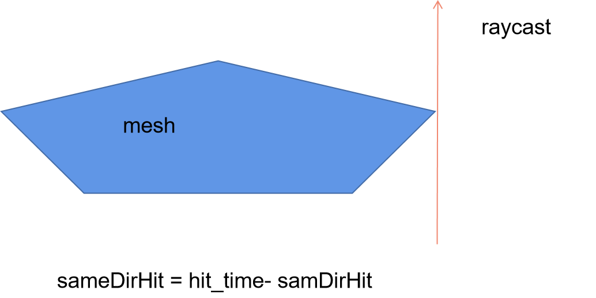
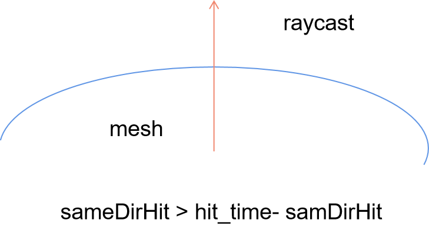
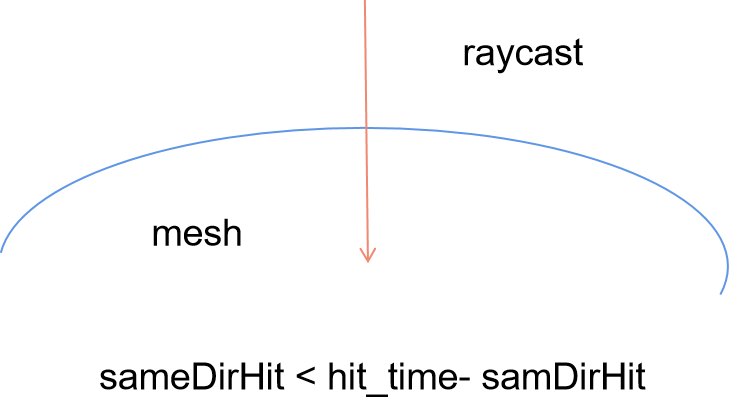
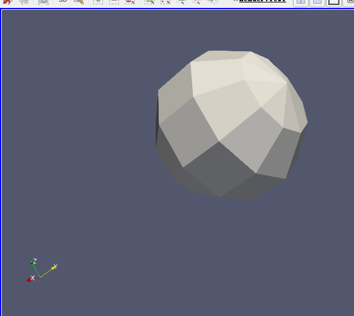
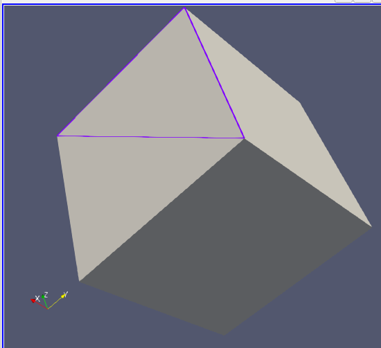
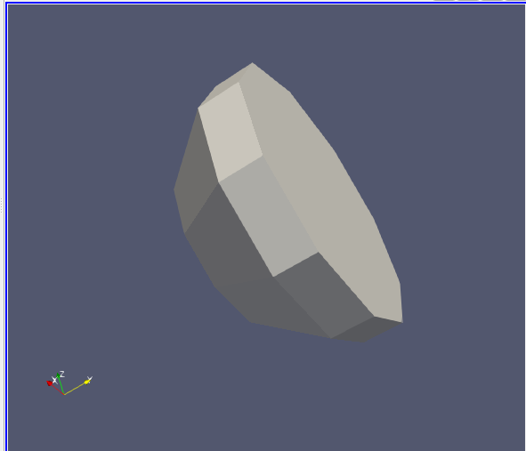
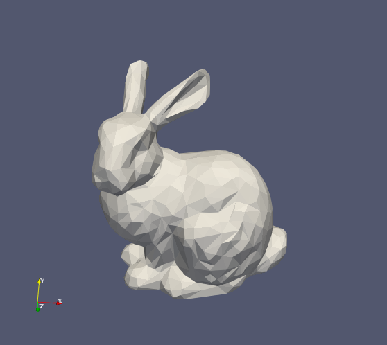
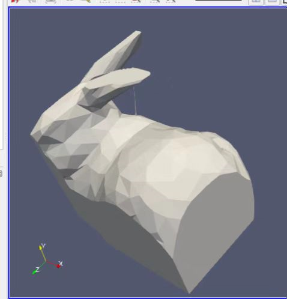

# 布尔运算原理
* ## FBoxAccelerator类
  在BoxAccelerator中，以输入的mesh的包围盒生成10\*10\*10的Grid集合，然后将在Grid内的三角形存在map中。调用CollecteTriangles函数可以获取对应包围盒内包含的三角形。主要目的是过滤掉不需要参与计算的三角形

        #ifndef FACCELLERATOR_H
        #define FACCELLERATOR_H
        #include "FBoundingBox.h"
        #include <unordered_set>
        class FBoxAccelerator
        {
        public:
            FBoxAccelerator(FBoundingBox& box,FMeshData& mesh,int level=10);
            ~FBoxAccelerator();
            FMeshData CollecteTriangles(FBoundingBox& box);
        private:
            void _BuildBox(FMeshData& mesh);
        private:
            FBoundingBox m_Box;
            FMeshData m_MeshData;
            int m_Level;
            std::vector<std::vector<int>> m_Map;
            std::vector<FBoundingBox> m_Grids;
        };
        #endif // !FACCELERATOR_H
* ## FGeometryCollection类
  1. 在GeometryCollection中，主要做的是将两组mesh数据计算求交结果，然后进行多边形三角化，最后再对多余的三角形进行剔除得到最终的布尔运算结果。

            class FGeometryCollection
            {
            public:
                FGeometryCollection(FBoundingBox &box, FMeshData &meshdata);
                ~FGeometryCollection();

                FMeshData FetchResult(CollectionType type);
                void SetMeshB(FMeshData& meshdata);
                bool CalculateIntersect();
                void Clean(CollectionType type);
                void Triangulate();
            private:
                void _GetMeshAInMeshB(std::unordered_set<FTriangle>& meshA, std::unordered_set<FTriangle>& meshB);
                void _Merge();
            private:
                std::unordered_set<FTriangle> m_MeshASet;
                std::unordered_set<FTriangle> m_MeshBSet;

                FMeshData m_MeshA;
                FMeshData m_MeshB;
                FMeshData m_Result;
                
                std::unordered_map<TrianglePair, IntersectEdge> m_IntersectMap;
                std::unordered_map<FTriangle, std::unordered_set<FTriangle>> m_IntersectNeighbors;

                std::unordered_map<FTriangle, std::unordered_set<FVertex>> m_TrianglesIntersction;
                FBoundingBox m_Box;
            };
   2. 计算三角形相交时主要考虑的是三角形共面与非共面的两种情况

            bool FGeometryCollection::CalculateIntersect()
            {
                bool anyIntersect = false;
                if (m_MeshA.m_Triangles.empty() || m_MeshB.m_Triangles.empty())
                    return anyIntersect;
                for (auto  triA:m_MeshA.m_Triangles) {
                    for (auto triB:m_MeshB.m_Triangles) {
                        if (!WeakBoundingBoxIntersection(triA.box, triB.box)) {
                            continue;
                        }
                        IntersectEdge* edge=nullptr;
                        TrianglePair newPair1(triA, triB);
                        TrianglePair newPair2(triB, triA);
                        auto it = m_IntersectMap.find(newPair1);
                        if (it == m_IntersectMap.end())
                            IntersectUtils::TrianglesIntersect(triA, triB, edge);
                        else {
                            edge = new IntersectEdge[2];
                            edge[0] = it->second;
                            edge[1] = m_IntersectMap.find(newPair2)->second;
                        }
                            
                        if (edge) {
                            m_IntersectMap.emplace(newPair1, edge[0]);
                            m_IntersectMap.emplace(newPair2, edge[1]);

                            auto it = m_IntersectNeighbors.find(triA);
                            if (it != m_IntersectNeighbors.end())
                                it->second.emplace(triB);
                            else {
                                std::unordered_set<FTriangle> set;
                                set.emplace(triB);
                                m_IntersectNeighbors.emplace(triA, set);
                            }

                            it = m_IntersectNeighbors.find(triB);
                            if (it != m_IntersectNeighbors.end())
                                it->second.emplace(triA);
                            else {
                                std::unordered_set<FTriangle> set;
                                set.emplace(triA);
                                m_IntersectNeighbors.emplace(triB, set);
                            }
                        }
                        else {
                        }
                    }
                }

                for (auto tri : m_MeshA.m_Triangles) {
                    if (m_IntersectNeighbors.find(tri) == m_IntersectNeighbors.end())
                        m_MeshASet.emplace(tri);
                }
                for (auto tri : m_MeshB.m_Triangles) {
                    if (m_IntersectNeighbors.find(tri) == m_IntersectNeighbors.end())
                        m_MeshBSet.emplace(tri);
                }
                anyIntersect = (m_MeshASet.size()!=m_MeshA.m_Triangles.size());
                return anyIntersect;
            }
    3. 求交完后，相交的三角形对最多形成两个交点（一条边），一个三角形与多个三角形相交，找到的边会将三角形划分为一个或多个多边形，输入三角形三角形顶点以及相交的所有边进行三角化计算。计算三角化时，先将所有点投影到二维空间中，然后找到半边数据结构（Half Edge）存储的相交数据中在三角形边上的起点和终点得到多个多边形，然后将多边形使用耳切法进行三角化。

            class FTriangulator
            {
            public:
                static bool Triangulating(FTriangle& triangle, std::vector<FVertex>& points,std::unordered_map<FIndex, std::unordered_set<FIndex>>& neighborMapFrom3,std::vector<FTriangle>&triangles);
            private:
                FTriangulator(std::vector<FVertex>& points);
                FTriangulator(FTriangle& triangles);
            public:
                void SetEdges(std::vector<FVertex>& points,
                    std::unordered_map<FIndex, std::unordered_set<FIndex>>* neighborMapFrom3);
                bool ReTriangulate();
                const std::vector<std::vector<FIndex>>& GetPolygons() const;
                const std::vector<std::vector<FIndex>>& GetTriangles() const;
            private:
                FVec3 m_projectAxis;
                FVec3 m_projectOrigin;
                FVec3 m_projectNormal;
                std::vector<FVec2> m_points;
                const std::unordered_map<FIndex, std::unordered_set<FIndex>>* m_neighborMapFrom3 = nullptr;
                std::vector<std::vector<FIndex>> m_polylines;
                std::vector<std::vector<FIndex>> m_innerPolygons;
                std::vector<std::vector<FIndex>> m_polygons;
                std::unordered_map<FIndex, std::unordered_set<FIndex>> m_innerParentsMap;
                std::unordered_map<FIndex, std::unordered_set<FIndex>> m_innerChildrenMap;
                std::unordered_map<FIndex, std::vector<FIndex>> m_polygonHoles;
                std::vector<std::vector<FIndex>> m_triangles;

                void LookupPolylinesFromNeighborMap(const std::unordered_map<FIndex, std::unordered_set<FIndex>>& neighborMap);
                int AttachPointToTriangleEdge( FVec2& point);
                bool BuildPolygons();
                void BuildPolygonHierarchy();
                void Triangulate();
            };
    4. 三角形剔除阶段主要是判断一个mesh中的三角形是否在另外一个mesh内部，这里我们只需要判断三角形有一个点或者是重心在mesh外，就可以判断三角形在mesh外部。
   
            void FGeometryCollection::_GetMeshAInMeshB(std::unordered_set<FTriangle>& meshA, std::unordered_set<FTriangle>& meshB) {
                std::unordered_set<FVec3> pointsOutOfMeshB;
                std::unordered_set<FVec3> pointsInMeshB;
                std::unordered_set<FTriangle> triangleToDelete;

                for (auto& triangleA : meshA) {
                    auto center = (triangleA.i().position + triangleA.j().position + triangleA.k().position) / 3;
                    std::vector<FVec3>points = {
                        center,
                        triangleA.i().position,
                        triangleA.j().position,
                        triangleA.k().position,

                    };
                    for (auto& point : points) {
                        auto it = pointsOutOfMeshB.find(point);
                        if (it != pointsOutOfMeshB.end()) {
                            triangleToDelete.emplace(triangleA);
                            break;
                        }
                        else {
                            bool isIn = false;
                            for (auto test : g_testAxisList) {
                                if (pointsInMeshB.find(point) != pointsInMeshB.end() || IntersectUtils::IsInMesh(meshB, point, test)) {
                                    isIn = true;
                                    break;
                                }
                            }
                            if (!isIn) {
                                pointsOutOfMeshB.emplace(point);
                                triangleToDelete.emplace(triangleA);
                                break;
                            }
                            else
                                pointsInMeshB.emplace(point);
                        }
                    }
                }

                for (auto triangle : triangleToDelete)
                    meshA.erase(triangle);
                triangleToDelete.clear();
            }
    5. 判断点在mesh外部使用的是射线检测法。计算射线与三角形的相交次数。记录射线方向与三角形法线方向相同时的相交次数，大于方向相反时的相交次数时，说明点在mesh内部。(相交情况如下图所示)

        <table rules="none" frame= "void">
            <tr>
                <td>
                    

                        
                    

                </td>
                <td>
                    

                        
                    

                </td>    
                <td>
                    

                        
                    

                </td>
            </tr>
            <tr>
                <td>
                    

                        
                    

                </td>
                <td>
                    

                        
                    

                </td>    
            </tr>
        </table>

            static bool IsInMesh(/*FMeshData&meshdata, */std::unordered_set<FTriangle>& triangles,FVec3 point, const FVec3& testAxis)
            {
                //std::vector<FTriangle>& triangles = meshdata.m_Triangles;
                //point = point * SCALE;
                FVec3 testEnd = point + testAxis;
                bool inside = false;
                FBoundingBox box;
                box.Include(point);
                box.Include(testEnd);
                std::unordered_set<DetectPair> hits;
                int time = 0;
                for (const auto triangle : triangles) {
                    //triangle.box *= SCALE ;
                    if (!WeakBoundingBoxIntersection(box, triangle.box))
                        continue;
                    std::vector<FVec3> trianglePositions = {
                        triangle.i().position ,
                        triangle.j().position,
                        triangle.k().position
                    };
                    FVec3 intersection;
                    FVec3 normal = Normal(triangle.i().position, triangle.j().position, triangle.k().position);

                    if (IsInTriangle(point, trianglePositions.data())) {
                        return true;
                    }
                    if (IntersectUtils::IntersectSegmentAndPlane(point, testEnd,
                        trianglePositions[0],
                        normal,
                        &intersection)) {
                        if (IsInTriangle(intersection, trianglePositions.data())) {
                            float dir = normal.Dot((testAxis/FLOAT_MAX).Normalize());
                            bool sameDir = dir > 0;
                            if (hits.emplace(std::make_pair(intersection,sameDir)).second&&sameDir)
                                time++;
                        }
                    }
                }
                inside = (2*time > hits.size());
                return inside;
            }
          

            static bool IntersectSegmentAndPlane( FVec3& segmentPoint0,  FVec3& segmentPoint1,
                FVec3& pointOnPlane, FVec3& planeNormal,
                FVec3* intersection)
            {
                FVec3 u = segmentPoint1 - segmentPoint0;
                FVec3 w = pointOnPlane - segmentPoint0;
                float d = planeNormal.Dot(u);
                float n = planeNormal.Dot(w);
                //
                
                if (std::abs(d) <= FLOAT_EPSILON)
                if (Float::isWeakZero(d))
                    return false;
                auto s = n / d;
                if (s < 0 || s> 1 || std::isnan(s) || std::isinf(s))
                    return false;
                if (intersection!=nullptr)
                    *intersection = segmentPoint0 + u * s;
                return true;

            }
         

            static bool IsInTriangle(FVec3& intersection,FVec3* trianglePositions) {
                //点在三角形内
                std::vector<FVec3> normals;
                for (size_t i = 0; i < 3; ++i) {
                    size_t j = (i + 1) % 3;

                    if (intersection == trianglePositions[i] || intersection.IsOnSegment(trianglePositions[i], trianglePositions[j]))
                        return true;
                    normals.push_back(Normal(intersection, trianglePositions[i], trianglePositions[j]));
                }
                float d1 = normals[0].Dot(normals[1]);
                float d2 = normals[0].Dot(normals[2]);
                float d3 = normals[1].Dot(normals[2]);
                //在三角形内或三角形边上时
                return (d1+FLOAT_EPSILON >= 0 && d2 + FLOAT_EPSILON >= 0 && d3+FLOAT_EPSILON >= 0);
            }

## 运行截图
<table rules="none" frame= "void">
    <tr>
        <td>
            

                <text>meshA</text>
            

        </td>
        <td>
            

               <text>meshB</text>
            

        </td>    
        <td>
            

                <text>result</text>
            

        </td>
    </tr>
    <tr>
        <td>
            

                
            

        </td>
        <td>
            

                
            

        </td>  
        <td>
            

                
            

        </td>    
    </tr>
        <tr>
        <td>
            

                
            

        </td>
        <td>
            

                
            

        </td>  
        <td>
            

                
            

        </td>    
    </tr>
</table>